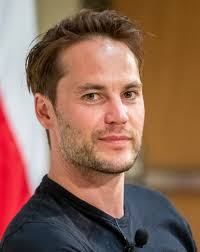

# Cody Garner

My favorite movie is Battleship. The reason that it my favorite movie is because i have always like the things to do with the military has I have grown in the army. Plus this movie has ships fighting alins form space after sending a message into space. So it a fight to stop them form calling more here and also to kill the ones that have show up.

---

This table are Actor that I suggest should play the role beside the main actor Taylor Kitsch.

| Actor Name | Reason Why | Actor Age |
| --- | --- | --- |
| Chris Pine | He played a great role as the main lead for "Star Trek". So I think he would be good canter to replace Taylor Kitsch | 44 |
| Scott Eastwood | He has the features and looks to pull off the position | 38 |
| Autin Butler | Has good experience in this types of movies for the character aspect | 33 |
| Tom Hanks | He has multiple years of exprience in military movies. | 68 |

---